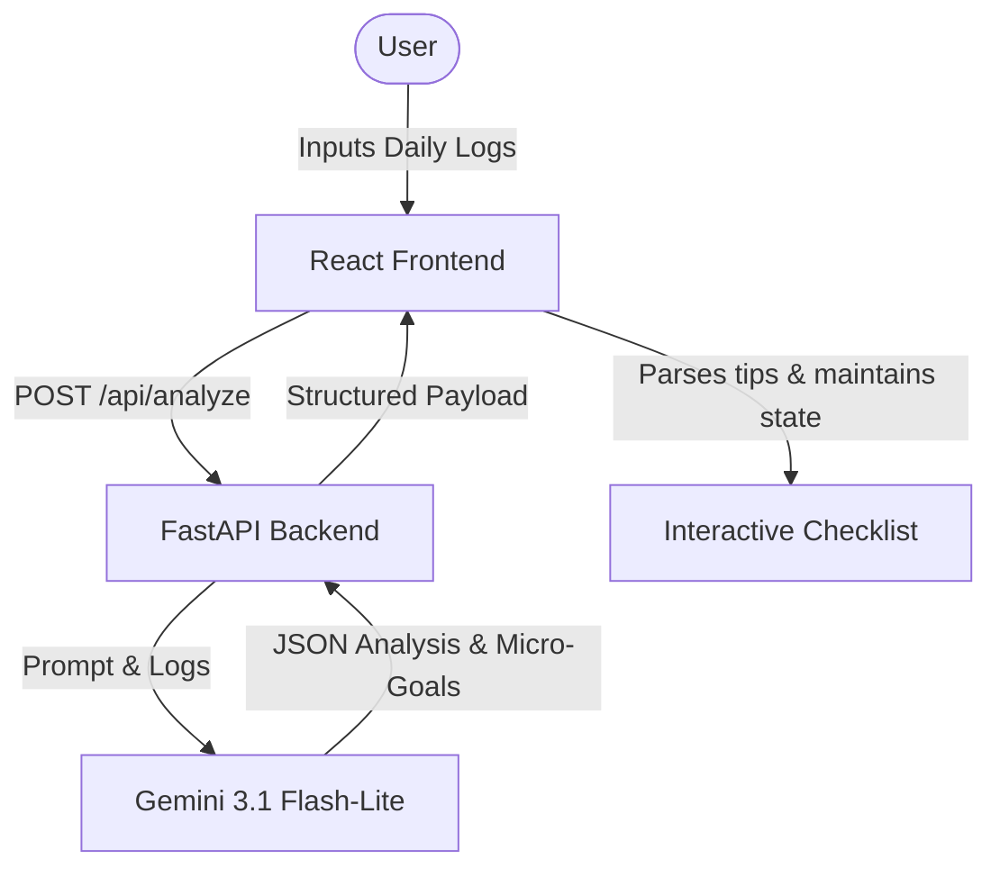

# GreenStep AI 🌿

GreenStep AI is an intelligent daily activity carbon footprint tracker that helps users understand their environmental impact and reduce their carbon footprint through personalized, gamified micro-goals.

## Key Features

- **Natural Language Activity Logging**: Describe your daily activities in plain text (e.g., *"I drove 15 miles in a gasoline SUV, had a cheeseburger for lunch, and ran the AC all day"*).
- **Automated Footprint Estimation**: Real-time breakdown of CO₂ equivalent emissions (in kg) categorized into **Transportation**, **Food**, and **Energy** powered by Gemini 3.1 Flash.
- **Interactive Checklist**: Dynamic checklist generated from AI recommendations, tracking your daily goals locally.
- **Gamified Achievements**: Celebratory progress banner showing task completion status with a visual progress bar and a micro-dopamine hit (`🎉 Excellent job reducing your footprint today!`) upon completing all tasks.
- **Keyboard & Screen Reader Accessible**: High-contrast, fully keyboard-navigable interface following WCAG standards.

## Project Architecture



## Getting Started

### Prerequisites

- Node.js (v18+)
- Python (3.10+)
- Gemini API Key (stored in `.env` file under the `backend` directory)

### Running the Backend

1. Navigate to the backend directory:
   ```bash
   cd backend
   ```
2. Activate your virtual environment:
   ```bash
   source venv/bin/activate
   ```
3. Run the FastAPI development server:
   ```bash
   uvicorn main:app --reload
   ```
   The backend will run on [http://localhost:8000](http://localhost:8000).

### Running the Frontend

1. Navigate to the frontend directory:
   ```bash
   cd frontend
   ```
2. Install dependencies (if not already done):
   ```bash
   npm install
   ```
3. Start the Vite development server:
   ```bash
   npm run dev
   ```
   The frontend will run on [http://localhost:5173](http://localhost:5173).

## Testing

To run the backend test suite:
```bash
cd backend
venv/bin/pytest
```
